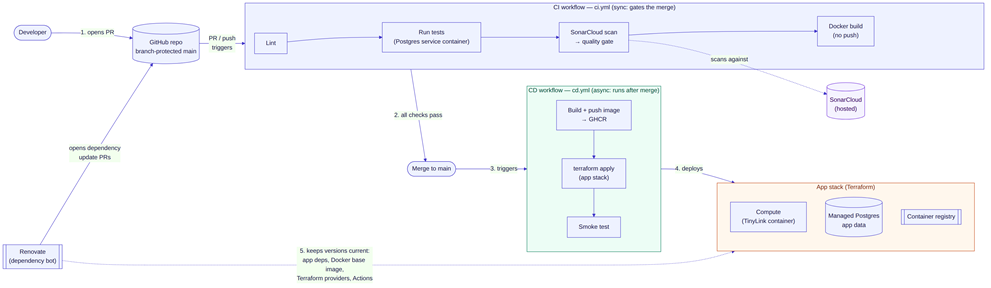
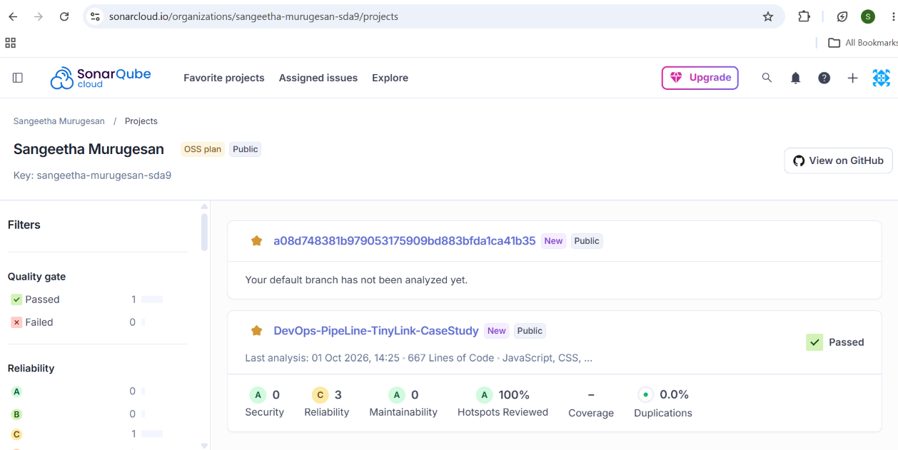
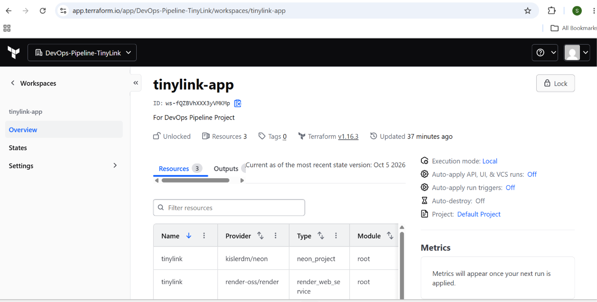
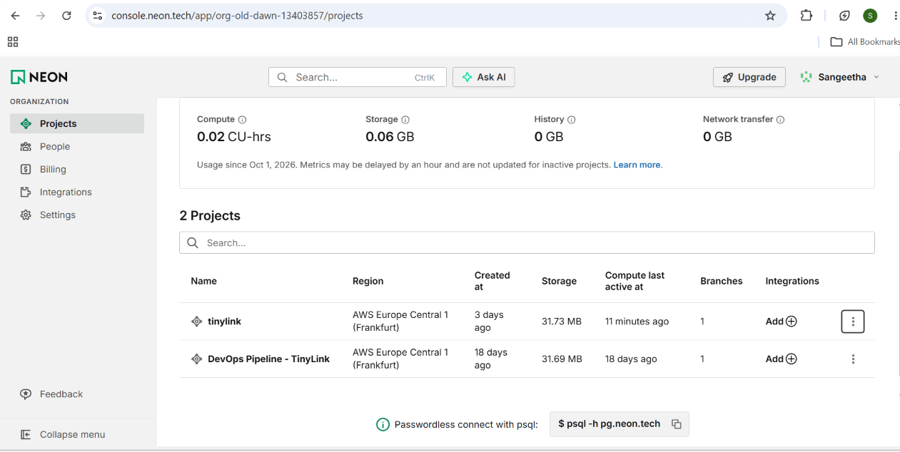
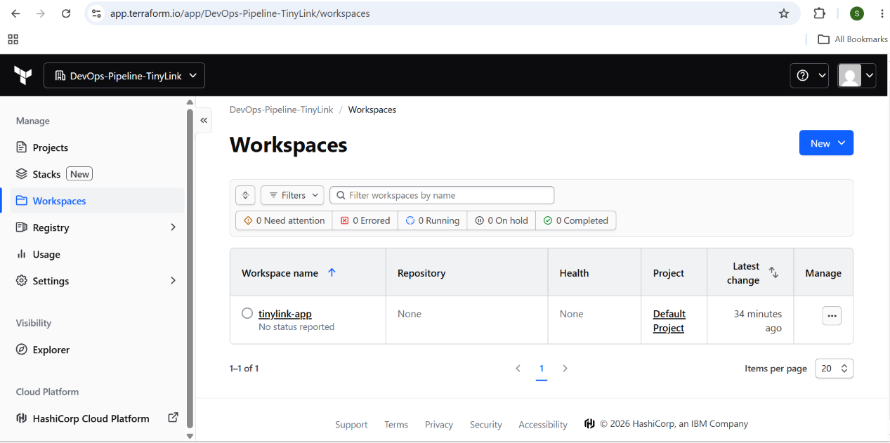

# Designing a Coherent DevOps Pipeline for a Full-Stack Web Application: A TinyLink Case Study

DD2482 DevOps, KTH | Sangeetha Murugesan and Anna Remmare | October 2026

## 1. Introduction and application

This report describes the DevOps pipeline we built around TinyLink, a URL-shortening service. The application is deliberately simple. A Node.js/Express backend creates a short code for a URL (optionally a user-chosen alias) and redirects a code back to its URL, a React frontend provides the UI including a QR code for each link, and PostgreSQL stores the data. The frontend and backend are built into one Docker image (a multi-stage build compiles the React app, and Express serves the static files and the API), so a single artifact moves through the whole pipeline. The application exists to give the pipeline something real to build, test, scan and deploy, the DevOps tooling is the subject of the project. The report covers the architecture and processes, the reasons for our choices, how the components interact, how AI tools were used, and the limitations. 

## 2. Architecture and processes

Figure 1 shows the flow from a pull request, through CI, to CD onto live infrastructure, with SonarCloud and Renovate feeding quality and dependency information back in.

CI (ci.yml) runs on every pull request to main and gates the merge. It lints the code, runs the tests (the backend tests run against a real PostgreSQL 16 service container, not a mock), runs a SonarCloud scan that must pass its quality gate, and builds the Docker image without pushing it. A ruleset on main requires a pull request and this check, so none of these steps can be skipped.

CD (cd.yml) runs only after a merge to main. It builds the image and pushes it to GitHub Container Registry tagged with the commit SHA, runs terraform apply with that tag so Render runs exactly the image that was just built, reads the service URL from the Terraform output, and calls GET /health on the new deployment as a smoke test. A failing smoke test turns a broken rollout into a red run immediately. Runs are serialized with a concurrency group so two deployments cannot overlap, and documentation-only changes do not trigger CD. Each run records the deployed URL on its summary page.

Infrastructure as Code. One Terraform stack declares a Neon PostgreSQL project and a Render web service running the container image from GHCR. Terraform state is kept remotely in HCP Terraform, which matters because GitHub Actions runners are discarded after each run and could not keep a local state file. API keys reach Terraform only as GitHub secrets passed as environment variables.

Quality and security automation. SonarCloud performs static analysis (bugs, vulnerabilities, code smells) on each change. Renovate opens pull requests for outdated npm packages, the Docker base image, GitHub Actions and Terraform providers; these go through the same CI gate as any human change. Evidence that the gate works: a Renovate pull request upgrading jsdom to v30 failed the frontend tests in CI and never reached main.

How the pieces interact. A change enters as a pull request, CI validates it, and the merge triggers CD. CD reuses the image built from the merged commit, Terraform reconciles Render and Neon with the code in the repository, and the smoke test checks the result. Renovate runs independently on a schedule but feeds its pull requests through the same path.

## 3. Design decisions and justification 

SonarCloud over self-hosted SonarQube. A self-hosted server would add a second piece of infrastructure to patch, back up and secure, which is not what this project is about. SonarCloud gives the same analysis and quality gate through one CI step and a token. 

Renovate over Dependabot. Both open update pull requests, but a single renovate.json covers npm (client and server), the Dockerfile, GitHub Actions and Terraform providers, and lets us state a policy: minor and patch updates may automerge, and major updates are disabled. We chose this after seeing that major bumps (for example React 19, Express 5, jsdom 30) can break the build or need a newer Node version, and we did not want unplanned upgrades. 

Render and Neon (free tiers) over a paid cloud target. Both have Terraform providers, so the IaC story is unchanged, and neither costs anything. We used Neon for the database because Render's own free Postgres expires after 30 days. 

Build once, deploy that image. CI proves the image builds, CD builds it again from the merged commit and deploys it by SHA tag, so what runs in production is traceable to a specific commit. 

Single environment. We considered a staging-to-production promotion with approvals and extra scanners, but kept the scope to what we could build, run and explain end to end. The cost of this choice is listed in Section 5. 

GitHub with a branch ruleset. Attaching required status checks to the ruleset makes the CI gate an enforced property of the repository. This became practical rather than theoretical when a teammate pushed directly to main, which prompted us to enable the rule. 

## 4. Documented use of AI-assisted tools 

We used Claude as an assistant, and we want to state precisely how.(1) Claude was used to  discuss about the  different security tools; (2) Suggest fixes while we debugged the pipeline; (3) walk us through the SonarCloud, Renovate, HCP Terraform.

The parts we did ourselves:We built TinyLink, a full-stack URL shortener (React, Node/Express, PostgreSQL), and a complete DevOps pipeline around it: CI that lints, tests, scans and builds on every pull request, and CD that builds a Docker image, deploys it with Terraform to Render and Neon after each merge, and smoke-tests the live app.

we created every account, API key and secret; we committed all changes and ran each one through the real CI and CD systems, reading the logs and error messages; we supplied the account-specific values (the Render owner ID and the Neon organization ID); we set the repository policies (the branch ruleset, disabling major Renovate updates, closing the pull request that CI rejected); and we checked the deployed application in a browser. 

## 5. Limitations and trade-offs

One environment. There is no staging stage, so a faulty deployment reaches the live service; only the CI gate and the smoke test protect it.

Replace instead of update. Render's free tier does not allow Terraform to update a running service in place (the provider's update sends a maintenance-mode setting that only paid plans support), so the pipeline deploys by replacing the service whenever the image tag changes (main.tf). The trade-off is a short outage during each deployment and a new URL suffix; on a paid plan an in-place update (or a blue-green rollout) would avoid this. Because of this, the live URL changes on every deployment; the current address can be read from the Smoke test step of the latest CD run and in the Render dashboard.

Free tiers. Render sleeps after 15 minutes without traffic and takes about a minute to answer the next request; Neon scales its compute to zero. Free-tier limits are on instance hours and storage, not on deployments, and none of them delete the project.

Security coverage. We focused automated security checks on code quality and dependencies: SonarCloud analyzes every change and Renovate keeps dependencies current. Secrets are kept out of the repository by design (they live in GitHub secrets and reach Terraform only as environment variables).
Scanning for committed secrets and for vulnerabilities in the container image is not automated yet.

Manual major upgrades. Disabling major updates keeps the build stable but means the project will fall behind unless someone reviews them.

Third-party dependence. SonarCloud, HCP Terraform, Render and Neon are external services whose availability and terms we do not control.

## 6. Visual evidence of the implemented pipeline

The following screenshots document the main parts of the setup and the successful infrastructure state.

These screenshots show the live configuration used to deploy TinyLink, verify the database layer, and confirm that the infrastructure state is consistent with the repository and the CI/CD workflow.

## 7. Conclusion 

TinyLink's functionality is minimal on purpose. The substance is the pipeline: pull requests are gated by lint, tests and a quality gate; merges build one image and deploy it with Terraform; and every choice above has a stated alternative and a stated cost. The pipeline is running, and we can explain how each part works and where it falls short. 

| Category | Requirement | How TinyLink meets it |
|---|---|---|
| Build and testing | CI pipeline | ci.yml: lint, tests on a real Postgres container, SonarCloud gate, Docker build |
| Deployment | CD pipeline | cd.yml: build and push image, terraform apply, smoke test |
| Infrastructure | Infrastructure as Code | Terraform (Render + Neon), remote state in HCP Terraform |
| Platform | Modern platform | GitHub; ruleset on main requires a PR and the CI check |
| Quality / security | At least one | SonarCloud quality gate and Renovate dependency PRs |
| AI-assisted tools | Documented | Section 4 |
| Repository | Fully functional | App, workflows, Terraform, README with setup steps |
| Report | 2-3 pages | This document |
